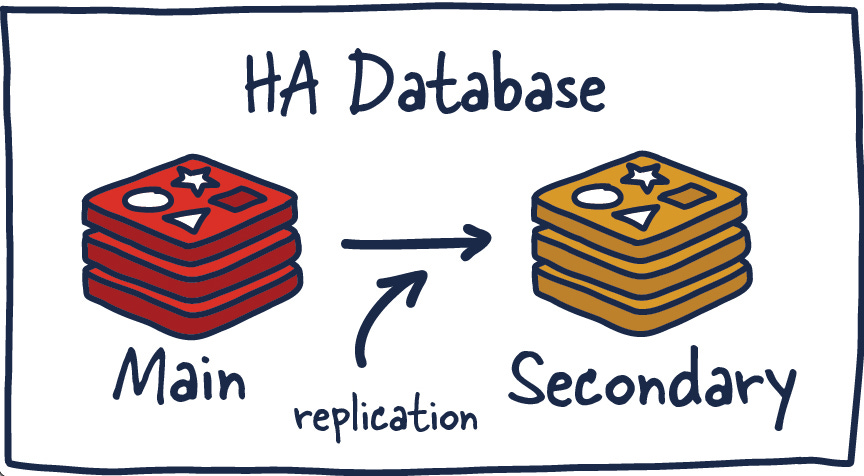
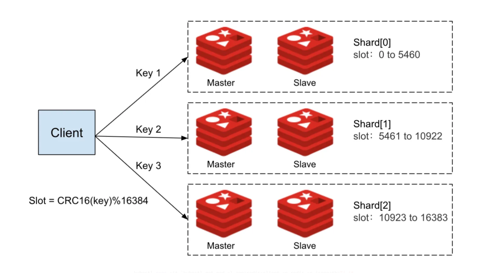
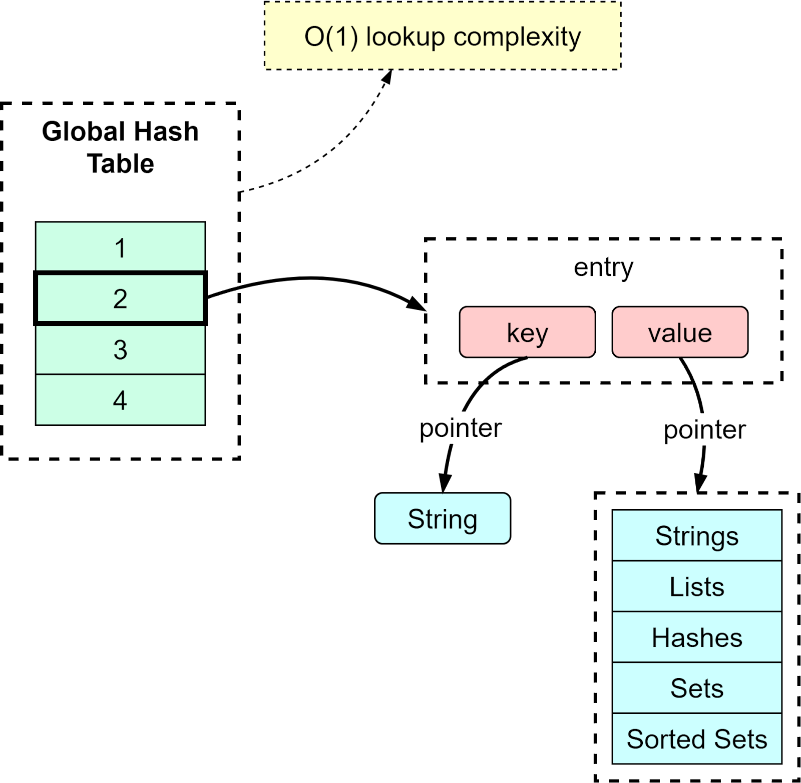
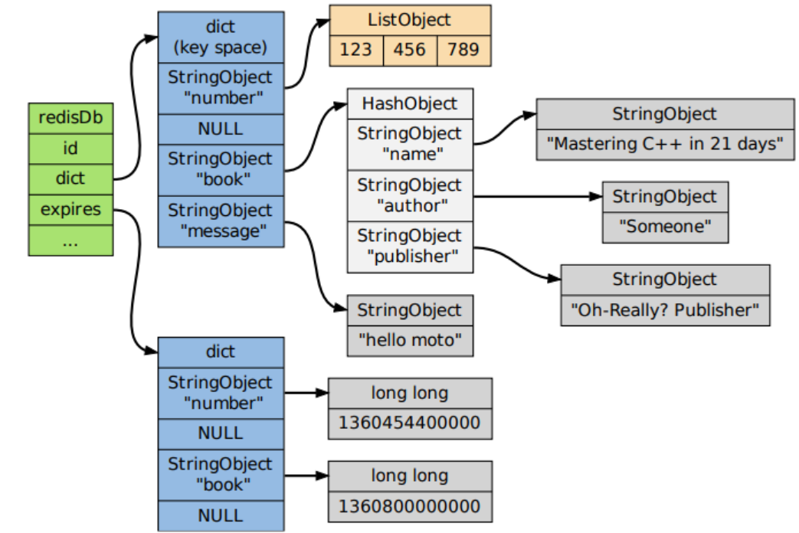

# 02. Caching Design

## Table of Contents

- [02. Caching Design](#02-caching-design)
  - [Table of Contents](#table-of-contents)
  - [1. Introduction](#1-introduction)
  - [2. Caching Strategies](#2-caching-strategies)
    - [2.1. Read](#21-read)
      - [2.1.1. Read-Aside cache](#211-read-aside-cache)
      - [2.1.2. Read-Through cache](#212-read-through-cache)
    - [2.2. Write](#22-write)
      - [2.2.1. Write-Through cache](#221-write-through-cache)
      - [2.2.2. Write-Around cache (Usually used)](#222-write-around-cache-usually-used)
      - [2.2.3. Write-Behind cache (Write-Back)](#223-write-behind-cache-write-back)
    - [2.3. Data Inconsistency](#23-data-inconsistency)
  - [3. Challenges](#3-challenges)
    - [3.1. Reliability Challenges](#31-reliability-challenges)
      - [3.1.1. Problem 01: No Atomicity](#311-problem-01-no-atomicity)
    - [3.1.2. Problem 02: Cache Avalanche](#312-problem-02-cache-avalanche)
    - [3.1.3. Problem 03: Cache Penetration](#313-problem-03-cache-penetration)
  - [3.2. High Traffic Challenges](#32-high-traffic-challenges)
    - [3.2.1. Problem 04: Cache Hot Keys](#321-problem-04-cache-hot-keys)
    - [3.2.2. Problem 05: Large Cache Size](#322-problem-05-large-cache-size)
  - [3.3. What if the Cache DB is running out of memory?](#33-what-if-the-cache-db-is-running-out-of-memory)
  - [4. Redis](#4-redis)
    - [4.1. Introduction](#41-introduction)
    - [4.2. Architecture](#42-architecture)
    - [4.2.1. Master-Slave Replication](#421-master-slave-replication)
    - [4.2.2. Sentinel](#422-sentinel)
    - [4.2.3. Cluster](#423-cluster)
    - [4.3. Why is Redis so fast?](#43-why-is-redis-so-fast)
    - [4.4. How Redis stores data?](#44-how-redis-stores-data)
    - [4.5 Expiration](#45-expiration)
      - [4.5.1. How does Redis handle expiration?](#451-how-does-redis-handle-expiration)
      - [4.5.2. Expiration Delete Strategies](#452-expiration-delete-strategies)
    - [4.6. Memory Eviction](#46-memory-eviction)
    - [4.7. Use Cases](#47-use-cases)
      - [4.7.1. String](#471-string)
      - [4.7.2. List](#472-list)
      - [4.7.3. Hash](#473-hash)
      - [4.7.4. Set](#474-set)
      - [4.7.5. Sorted Set](#475-sorted-set)
      - [4.7.6. Usecase 01](#476-usecase-01)
    - [4.7.7. Usecase 02](#477-usecase-02)
    - [4.8. Some Limitations](#48-some-limitations)
      - [4.8.1. Big Keys](#481-big-keys)
      - [4.8.2. Different keys on different nodes](#482-different-keys-on-different-nodes)
      - [4.8.3. Distributed Locks](#483-distributed-locks)

## 1. Introduction

- A Cache is a hardware or software component that stores data so that future requests for that data can be served faster.
- The data in cache:
    - **A copy of frequently accessed data** from a slower storage layer (like a database).
    - **Computed results of expensive operations.**
- Caching is used to improve performance, reduce latency, and decrease the load on backend systems.
- Trade-off:
    - Performance vs. consistency (Synchronize between cache and database).
    - Performance vs. cost (Space).
- Cache is **not a replacement** for a database.
- The cache `hit rate` is a key metric to measure the effectiveness of caching.
- Follow `80/20 rule`: 20% of objects are used 80% of the time.

## 2. Caching Strategies

### 2.1. Read

#### 2.1.1. Read-Aside cache

The cache is checked first, and if the data is not found, it is fetched from the database and stored in the cache. In cache-aside, the application is responsible for fetching data from the database and populating the cache.

- Cache hit:
```bash
┌─────────────┐    ┌─────────────┐    ┌─────────────┐
│   Client    │    │    Cache    │    │  Database   │
└──────┬──────┘    └──────┬──────┘    └──────┬──────┘
       │                  │                  │
       │ 1. GET user/123  │                  │
       ├─────────────────►│                  │
       │                  │                  │
       │                  │ 2. Key exists    │
       │                  │    ✓ HIT         │
       │                  │                  │
       │ 3. Return data   │                  │
       │◄─────────────────┤                  │
       │                  │                  │
       │                  │                  │
```

- Cache miss:
```bash
┌─────────────┐    ┌─────────────┐    ┌─────────────┐
│   Client    │    │    Cache    │    │  Database   │
└──────┬──────┘    └──────┬──────┘    └──────┬──────┘
       │                  │                  │
       │ 1. GET user/456  │                  │
       ├─────────────────►│                  │
       │                  │                  │
       │ 2. Key not found │                  │
       │    ✗ MISS        │                  │
       │◄─────────────────┤                  │
       │                  │ 3. Query DB      │
       │────────────────────────────────────►│
       │                  │                  │
       │                  │ 4. Return data   │
       │◄────────────────────────────────────┤
       │                  │                  │
       │ 5. Store in cache│                  │
       │─────────────────►│                  │
       │                  │                  │
       │                  │                  │
       │                  │                  │
```

- Advantages:
    - Tolerate cache failures (cache is decoupled from database).
    - Flexible for data models.
- Disadvantages:
    - Increased complexity.
    - Data inconsistency risk.

#### 2.1.2. Read-Through cache

The cache sits between the client and the database. When a cache miss occurs, the cache automatically loads data from the database. In read-through, this logic is usually supported by the library or stand-alone cache provider. Unlike cache-aside, the data model in read-through cache cannot be different than that of the database.

- Cache hit:
```bash
┌─────────────┐    ┌─────────────┐    ┌─────────────┐
│   Client    │    │    Cache    │    │  Database   │
└──────┬──────┘    └──────┬──────┘    └──────┬──────┘
       │                  │                  │
       │ 1. GET user/123  │                  │
       ├─────────────────►│                  │
       │                  │                  │
       │                  │ 2. Key exists    │
       │                  │    ✓ HIT         │
       │                  │                  │
       │ 3. Return data   │                  │
       │◄─────────────────┤                  │
       │                  │                  │
```

- Cache miss:
```bash
┌─────────────┐    ┌─────────────┐    ┌─────────────┐
│   Client    │    │    Cache    │    │  Database   │
└──────┬──────┘    └──────┬──────┘    └──────┬──────┘
       │                  │                  │
       │ 1. GET user/456  │                  │
       ├─────────────────►│                  │
       │                  │                  │
       │                  │ 2. Key not found │
       │                  │    ✗ MISS        │
       │                  │                  │
       │                  │ 3. Auto-load     │
       │                  ├─────────────────►│
       │                  │                  │
       │                  │ 4. Return data   │
       │                  │◄─────────────────┤
       │                  │                  │
       │                  │ 5. Store & return│
       │ 6. Return data   │                  │
       │◄─────────────────┤                  │
       │                  │                  │
```

- Advantages:
    - Simplified application logic (cache handles DB loading).
    - Consistent interface for applications.
    - Reduces duplicate code across services.
- Disadvantages:
    - Cache becomes a single point of failure.
    - Limited flexibility in loading logic.

### 2.2. Write

#### 2.2.1. Write-Through cache

Data is written to both cache and database simultaneously. The write operation is only considered successful when both operations complete.

```bash
┌─────────────┐    ┌─────────────┐    ┌─────────────┐
│   Client    │    │    Cache    │    │  Database   │
└──────┬──────┘    └──────┬──────┘    └──────┬──────┘
       │                  │                  │
       │ 1. POST user/123 │                  │
       ├─────────────────►│                  │
       │                  │                  │
       │                  │ 2. Write to DB   │
       │                  ├─────────────────►│
       │                  │                  │
       │                  │ 3. Success       │
       │                  │◄─────────────────┤
       │                  │                  │
       │                  │ 4. Update cache  │
       │                  │                  │
       │ 5. Success       │                  │
       │◄─────────────────┤                  │
```

- Advantages:
    - Data consistency between cache and database.
    - Fast subsequent reads.
- Disadvantages:
    - Slower write operations.
    - Cache may store infrequently accessed data.
    - Write latency increases.

#### 2.2.2. Write-Around cache (Usually used)

Data is written directly to the database, bypassing the cache. Cache is only populated on read misses. We may invalidate the cache entry after a write operation, but it is not mandatory.

```bash
┌─────────────┐         ┌─────────────┐    ┌─────────────┐
│   Client    │         │    Cache    │    │  Database   │
└──────┬──────┘         └──────┬──────┘    └──────┬──────┘
       │                       │                  │
       │ 1. POST user/123      │                  │
       ├─────────────────────────────────────────►│
       │                       │                  │
       │                       │ 2. Write data    │
       │                       │                  │
       │ 3. Success            │                  │
       │◄─────────────────────────────────────────┤
       │ 4. Invalidate cache   │                  │
       │──────────────────────►│                  │
       │                       │                  │
```

- Advantages:
    - Fast write operations.
    - No cache invalidation complexity.
    - Good for write-heavy workloads.
    - Prevents cache pollution with infrequently accessed data.
- Disadvantages:
    - Recent writes not available in cache.
    - Higher read latency for new data.
    - Cache miss penalty for newly written data.

#### 2.2.3. Write-Behind cache (Write-Back)

Data is written to cache immediately and asynchronously written to database later.

```bash
┌─────────────┐    ┌─────────────┐    ┌─────────────┐
│   Client    │    │    Cache    │    │  Database   │
└──────┬──────┘    └──────┬──────┘    └──────┬──────┘
       │                  │                  │
       │ 1. POST user/123 │                  │
       ├─────────────────►│                  │
       │                  │                  │
       │                  │ 2. Write to cache│
       │                  │                  │
       │ 3. Success       │                  │
       │◄─────────────────┤                  │
       │                  │                  │
       │                  │ 4. Async write   │
       │                  ├─────────────────►│
       │                  │    (batched)     │
```

- Advantages:
    - Fastest write performance.
    - Good for write-heavy applications.
    - Reduces database load through batching.
    - Better throughput.
- Disadvantages:
    - Risk of data loss if cache fails.
    - Complex implementation.
    - Eventual consistency issues.
    - Requires robust error handling.

### 2.3. Data Inconsistency

- **Cache Invalidation**:
    - **Time-based**: Set a TTL (Time To Live) for cache entries.
    - **Command-based**: Application logic to invalidate cache entries when data changes.
    - **Event-based**: Use events to trigger cache invalidation (e.g., message queues).
    - **Group-based**: Invalidate all entries related to a specific key or pattern.

- Why Cache Invalidation is Hard:
    - **Timing**: How long enough for TTL?
    - **Concurrency**: Race condition.
    - **Data Relationships**: Complex relationships can lead to cascading invalidations.
    - **Unlike Database, Cache can be everywhere and anywhere**: Hard to finding root causes.

- Consider Solution: 
  - `Read-Aside` + `Write-Around` with invalidation: `DELETE cache`. (`RA-DWA`).
  - It may remain data inconsistency for a short time, but it is acceptable in most cases. We can use `TTL` to reduce the inconsistency time.
  - Update DB first, delete cache later.

## 3. Challenges

### 3.1. Reliability Challenges

#### 3.1.1. Problem 01: No Atomicity

- **Context**:
  - Customer updates their profile: Age from 33 to 34.
  - But customer X complains that it needs some time to take effect.
  - Currently system is using `Read-Aside` + `Write-Through` cache.
  - The profile of customer X in cache is not updated yet.
- **Cause**:
    - `Cache` and `Database` are different systems.
    - Database may write successfully, but cache may fail to update.
    - Cache may return stale data.

```bash
┌─────────────┐    ┌─────────────┐    ┌─────────────┐
│   Client    │    │    Cache    │    │  Database   │
└──────┬──────┘    └──────┬──────┘    └──────┬──────┘
       │                  │                  │
       │ 1. UPDATE        │                  │
       │    age: 33→34    │                  │
       ├────────────────────────────────────►│
       │                  │ 2. Success ✓     │
       │◄────────────────────────────────────┤
       │                  │                  │
       │ 3. Update cache  │                  │
       │     ✗ FAILS      │                  │
       │─────────────────►│                  │
       │                  │                  │
       │ 4. GET user      │                  │
       ├─────────────────►│                  │
       │                  │                  │
       │ 5. Return        │                  │
       │    age: 33       │                  │
       │    (STALE!)      │                  │
       │◄─────────────────┤                  │
       │                  │                  │
```

- **Solution**:
    - Retry logic for cache update (Easy).
    - Use a message queue to ensure cache updates are processed (Hard).

### 3.1.2. Problem 02: Cache Avalanche

- **Context**:
  - Cache is down or cache entries or a "hot key" data are expired at the same time, 
  - All requests hit the database, causing a surge in load, leading to potential downtime.
- **Solution**:
    - **Cache Clustering**: Use multiple cache nodes to distribute load.
    - **Rate Limiting**: Limit the number of requests hitting the database during cache downtime.
    - **Circuit Breaker Pattern**: Temporarily stop requests to the database when it is overloaded.
    - **Even distribution** for TTL: Use a random TTL for cache entries to avoid simultaneous expiration.
    - With hot keys, we can do background preloading of cache entries before they expire or update cache periodically.

### 3.1.3. Problem 03: Cache Penetration

- **Context**:
  - A request for a non-existent key (e.g., user ID that does not exist) bypasses the cache and hits the database (It's also not in the database).
  - This can lead to excessive load on the database with many requests for non-existent data.
- **Solution**:
    - **Cache Empty Responses**: Store a special marker in the cache for non-existent keys to prevent repeated database hits.
    - **Bloom Filters**: Use a probabilistic data structure to quickly check if a key might exist before querying the cache or database.
    - **Strong Validation**: Validate requests before hitting the cache or database to ensure they are for valid keys.

## 3.2. High Traffic Challenges

### 3.2.1. Problem 04: Cache Hot Keys

- **Context**:
  - A small number of keys receive a disproportionately high number of requests (e.g., popular product ID). But these key only in Node A in a distributed cache.
- **Solution**:
    - **Cache Warming** or **Copy hot key into multiple nodes**: Preload frequently accessed data into the cache before it is requested.
    - **Local Caching**: Use local caches in each node to reduce the load on the central cache.

### 3.2.2. Problem 05: Large Cache Size

- **Context**:
  - Cache size is too large, leading to high memory usage and potential performance degradation, may increase latency.
- **Solution**:
    - **Data Compression**: Compress data before storing it in the cache to reduce memory usage.

## 3.3. What if the Cache DB is running out of memory?

- Least Recently Used (LRU) eviction policy: Remove the least recently used items from the cache when it reaches its memory limit.

```bash
Initial state: Empty cache (capacity = 3)

Operation 1: Get("A") → Cache miss → Add A
Cache state: [A]

Operation 2: Get("B") → Cache miss → Add B
Cache state: [B, A]

Operation 3: Get("C") → Cache miss → Add C
Cache state: [C, B, A]

Operation 4: Get("A") → Cache hit → Move A to front (most recently used)
Cache state: [A, C, B]

Operation 5: Get("D") → Cache miss → Cache full → Evict B (least recently used)
Cache state: [D, A, C]
```

- Least Frequently Used (LFU) eviction policy: Remove the least frequently accessed items from the cache.

```bash
Initial state: Empty cache (capacity = 3)
Access counts: {}

Operation 1: Get("A") → Cache miss → Add A (count = 1)
Cache state: [A:1]

Operation 2: Get("B") → Cache miss → Add B (count = 1)
Cache state: [A:1, B:1]

Operation 3: Get("A") → Cache hit → Increment A's count 
Cache state: [A:2, B:1]

Operation 4: Get("C") → Cache miss → Add C (count = 1)
Cache state: [A:2, B:1, C:1]

Operation 5: Get("D") → Cache miss → Cache full → Evict B or C (tied for least frequent)
Cache state: [A:2, C:1, D:1] (assuming B was chosen to evict)
```

## 4. Redis

### 4.1. Introduction

- Redis is an open-source, **in-memory database**.
- Various data structures: `strings`, `hashes`, `lists`, `sets`, `sorted sets`, ...
- Supports caching, pub/sub messaging, multiple clustering modes, and persistence...
- **Usecases**: Caching, key-value store, message queue, ...

### 4.2. Architecture

### 4.2.1. Master-Slave Replication

- `Replication`: Data is written to the master node and then replicated to one or more slave nodes asynchronously. Data can be read from both master and slave nodes.



- **Advantages**:
    - Improved read scalability (read from slaves).
- **Disadvantages**:
    - Data inconsistency risk (slaves may lag behind).
    - Failover issues (if master fails, a slave must be promoted).

### 4.2.2. Sentinel

- `Sentinel`: Provides high availability and monitoring for Redis. It can automatically promote a slave to master if the master fails.
- When Master fails, Sentinel will select a new master from the slaves and update other slaves to replicate from the new master.


- **Advantages**:
    - Automatic failover and monitoring.
- **Disadvantages**:
    - Data inconsistency.
    - Operational overhead.
    - All writes go to the master, which can become a bottleneck.

### 4.2.3. Cluster

- `Cluster`: Distributes data across multiple Redis nodes in different servers.
- 


- Redis Cluster manages data partitioning by using hash slots. 
- A cluster has a total of 16,384 hash slots, and each key is assigned to one of these slots based on a hash function. Each node in the cluster is responsible for a subset of these slots.
- One hash slots can have multiple keys, and each key is stored in one of the nodes.




- **Advantages**:
    - Sovlves failover issues.
    - Reduce the system's dependency on a single master.
    - Scalable read and write operations.
- **Disadvantages**:
    - Increased complexity.
    - Operational overhead.

### 4.3. Why is Redis so fast?

- Redis is fast because it stores data in memory, which allows for quick access and retrieval.
- Single Thread Model:
  - CPU is not a bottleneck because Redis usecase is not CPE intensive like computing.
  - Avoids context switching and locking overhead.
  - Multi-threading app requires locks or other synchronization mechanisms, which can slow down performance.
  - **Note**: After Redis 6, it supports multi-threading for I/O operations, but the core data structures and commands are still single-threaded.
- Multiplexing: One thread can handle multiple connections using I/O streaming.
- Efficient Data Structures.
- Bottleneck is usually not CPU, but rather:
  - Memory.
  - Network bandwidth.

### 4.4. How Redis stores data?

- Redis key is stored in a hash table.
- Each entry of the hash table is a `key-value` pair.



### 4.5 Expiration

#### 4.5.1. How does Redis handle expiration?

- Reids has two main dict to store keys:
  - `keyspace`: Stores all keys.
  - `expires`: Stores keys with expiration time.



- When accessing a key, Redis checks the `expires` dict first:
  - If the key is not found in `expires`, read the key as normal.
  - If the key is found in `expires`, check if it has expired:
    - If expired, delete the key from both `keyspace` and `expires`.
    - If not expired, return the key value.

#### 4.5.2. Expiration Delete Strategies

- `Passive Expiration`: Check expiration only when accessing the key.
  - Pros: Simple and efficient for low traffic.
  - Cons: Some keys is never accessed, leading memory space waste.
- `Active Expiration`: Periodic job (`activeExpireCycle()`): 10 times/s.
  - Randomly select 20 keys from `expires` dict and check if they are expired.
  - Check whether the key is expired, if so, delete it.
  - If the number of expired keys is less than 25% of the number of randomly selected keys, continue to check the next 20 keys.
  - If the number of expired keys is more than 25%, stop checking and wait for the next cycle.
  - Problem: If the number of expired keys is too large, it may take a long time to check all keys, active job may block other operations. We may set timeout for the active job to avoid blocking.
- This current `Active Expiration` strategy is not effective.
- New Approach: Using `radix tree` to store keys with expiration time, which allows for faster expiration checks and deletions. [What Are the Impacts of the Redis Expiration Algorithm?](https://redis.io/kb/doc/1fqjridk8w/what-are-the-impacts-of-the-redis-expiration-algorithm)

> Since Redis 1.0, developers have been able to set keys to expire after a given time, a feature indispensable for caching. This expiration has always relied on sampling techniques to avoid unpredictable delays when many keys expire at the same time. The expiration cycle has been rewritten in Redis 6.0 to allow for much faster expirations that more closely match the time-to-live (TTL) property. Additionally, you can now tune expirations to zero in on the accuracy required for your particular situation. [Redis 6.0](https://redis.io/blog/diving-into-redis-6/)

### 4.6. Memory Eviction

- `Noeviction`: Redis will return an error if it runs out of memory. (Default)
- `Random`: Randomly evict a key.
- `TTL`: Evict keys with the shortest time to live (TTL).
- `LRU`: Evict the least recently used keys.
- `LFU`: Evict the least frequently used keys.

### 4.7. Use Cases

#### 4.7.1. String

- **Introduction**: Redis strings store sequences of bytes, including text, serialized objects, and binary arrays. As such, strings are the simplest type of value you can associate with a Redis key. 
- Supports binary-safe strings.
- Applications:
    - Caching simple key-value pairs.
    - Storing counters (e.g., page views).
    - Storing JSON strings.
    - Share session data between services.
    - Distributed locks.

#### 4.7.2. List

- **Introduction**: Redis lists are linked lists of string values. 
- Elements can be added to the head or tail of the list.
- Applications:
  - Storing ordered data (e.g., user activity logs).
  - Messaging queues (e.g., pub/sub).
- Limitation:
  - The maximum length of a list is 2^32 - 1 elements (4,294,967,295).
  - List doestn't support multiple consumers, which means only one consumer can read from the list at a time. If multiple consumers try to read from the list, they will block each other.
  - Weak order preservation: If multiple consumers read from the list, the order of the elements may not be preserved.

#### 4.7.3. Hash

- **Introduction**: Redis hashes are record types structured as collections of field-value pairs. You can use hashes to represent basic objects and to store groupings of counters, among other things.
- Applications:
  - Storing objects with multiple fields (e.g., user profiles).
  - Shopping carts (e.g., product ID, quantity).
    - Add item: `HSET cart:123 product:456 2`
    - Increment quantity: `HINCRBY cart:123 product:456 1`
    - Get cart: `HGETALL cart:123`
    - Remove item: `HDEL cart:123 product:456`
    - Get item quantity: `HGET cart:123 product:456` 

#### 4.7.4. Set

- **Introduction**: A Redis set is an unordered collection of unique strings (members)
- Applications:
  - Storing unique items (e.g., user IDs, tags).
  - Social networks (e.g., friends, followers).
  - Deduplication (e.g., unique visitors).

#### 4.7.5. Sorted Set

- **Introduction**: A Redis sorted set is a collection of unique strings (members) ordered by an associated score. When more than one string has the same score, the strings are ordered lexicographically.
- Applications:
  - Leaderboards, Ranking (e.g., game scores).
  - Priority queues (e.g., tasks with different priorities).
  - Sorting data by score or timestamp.

#### 4.7.6. Usecase 01

- **Context**:
    - User object: {uid, username, email, aget}
    - Requirement::
      - C1: access username only.
      - C2: update age only.
      - C3: access all fields.
- **Which data structure should we use?**
  - `Hash`: Flexible for update or partial updates. Don't need to serialize/deserialize the whole object.
  - `JSON (string)`: Need to serialize/deserialize the whole object. Every update requires a full write. May easy to use, but not efficient.

### 4.7.7. Usecase 02

- **Context**:
  - When ordering a taxi, if there is no car owner to take the order within 5 minutes, the order will be cancelled.
  - The system will cancel your order automatically.
- **Solution**:
  - Use `Sorted Set` to store orders with a score of the order's expiration time.
  - When a new order is created, add it to the sorted set with the current time + 5 minutes as the score.
  - Use a background job to periodically check for expired orders and cancel them.
  - Use `ZRANGEBYSCORE` to get all orders that are expired.

### 4.8. Some Limitations

#### 4.8.1. Big Keys

- Big keys can cause performance issues in Redis, such as increased memory usage and slower operations.
- Approaches to deal with big keys:
  - Use the `SCAN` (instead of KEYS), `HLEN`, `SCARD`, `MEMORY USAGE`...
  - Use `UNLINK` to delete big keys asynchronously (instead of `DEL`).

#### 4.8.2. Different keys on different nodes

- Redis Cluster uses hash slots to distribute keys across nodes.
- Functions on 2 sets of keys that are not on the same node or different hash slots will not work.
- Force the keys to be on the same node by using the same [Hash tags](https://redis.io/docs/latest/operate/oss_and_stack/reference/cluster-spec/).
- To implement hash tags, the hash slot for a key is computed in a slightly different way in certain conditions. If the key contains a "`{...}`" pattern only the substring between { and } is hashed in order to obtain the hash slot.
- Example:
  - The two keys `{user1000}.following` and `{user1000}.followers` will hash to the same hash slot since only the substring `user1000` will be hashed in order to compute the hash slot.

#### 4.8.3. Distributed Locks

- Redis can be used to implement distributed locks using the `SET` with the `NX` argument when migrating or writing new code.
- Syntax:

```bash
# SET key value [NX | XX] [GET] [EX seconds | PX milliseconds | EXAT unix-time-seconds | PXAT unix-time-milliseconds | KEEPTTL]
SET lock_key unique_value NX PX 30000
```