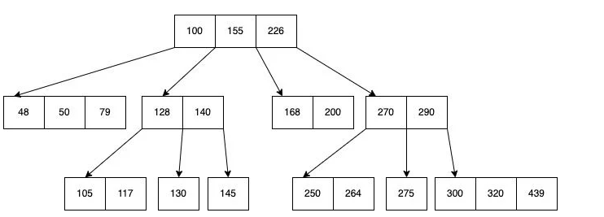
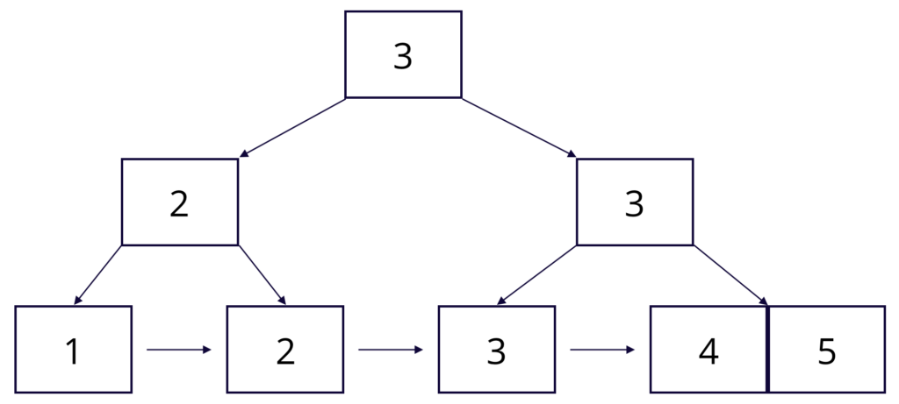

# 03. Index

> An index is a data structure that improves the speed of data retrieval operations on a database table at the cost of additional space and slower writes.
> [Wikipedia](https://en.wikipedia.org/wiki/Index_(database))

## 1. Introduction

- Indexes are used to speed up data retrieval operations in databases.
- Indexes are **typically stored on disk**.

## 2. Classification

- **By data structure**: B+tree, hash, bitmap, etc.
- **By Physical storage**: clustered, non-clustered, etc.
- **By number of columns**: single-column, multi-column, etc.
- **By characteristics**: Primary, unique, prefix, full-text, etc.

### 2.1. Data Structures

> What factors should be considered when mentioning data structures and algorithms?

- Usecase.
- Time complexity.
- Space complexity.
- Complexity of implementation.

#### 2.1.1. B-Tree (Balanced Tree)

- All leaves are at the same level.
- Each node contains a sorted list of keys and pointers to child nodes.
- Insertion, deletion, and search operations can be performed in O(log n) time.

#### 2.1.2. B+ Tree

- A variation of B-Tree.
- The pointers to the actual records are stored only in the leaf nodes.
- The internal nodes only contain keys and pointers to other nodes. Many keys can be stored in internal nodes.
- All leaf nodes are linked together, allowing for efficient range queries.

#### 2.1.3. Hash Index

> A "Good" hash function is one that minimizes collisions, evenly distributes keys, and is fast to compute.

- Uses a hash function to compute the address of the data.
- Fast for equality searches.
- Limitations:
    - Not suitable for range queries.
    - Requires a good hash function to minimize collisions.

### 2.2. Physical Storage

#### 2.2.1. Clustered Index

- Clustered index is a type of index that determines the physical order of data in a table.
- A table can **have only one** clustered index.
- The leaf nodes of a clustered index contain the actual data rows.
- By default, primary keys are clustered indexes. But we can choose different columns as clustered indexes, separate from the primary key.
- In `InnoDB`, cluster index use `B+Tree` structure (can't use hash index).

#### 2.2.2. Non-Clustered Index

- Indexes are not clustered index, then non-clustered index.
- The value (the leaf node of B+Tree) of secondary index is **the primary key value**.
- A table can have multiple secondary indexes.
- Accessing data using a secondary index involves two steps:
    1. Use the secondary index to find the primary key.
    2. Use the primary key to find the actual data row.

> What is the disadvantage of indexes?

- Slow down write operations.
- Occupy additional disk space.
- Take time to create and maintain indexes.

### 2.3. Characteristics

> What is the difference between key and index?

- **Key**: a constraint defined the behavior of data in a database table, such as primary key, foreign key, etc. It ensures data integrity and uniqueness.
- **Index**: An index is a data structure that improves the speed of data retrieval operations on a database table. It is used to quickly locate and access the data without scanning the entire table.

#### 2.3.1. Primary Index

- Primary index is a specific type of index that serves as a unique identifier for each record in a table.

#### 2.3.2. Unique Index

- Unique index ensures that the values in a column or a combination of columns are unique across the table (but can be null).

### 2.4. Columns

#### 2.4.1. Single-Column Index

- An index created on a single column of a table.

#### 2.4.2. Multi-Column Index

Example: Multi-Column Index (`country`, `province`, `name`).

> Which of the following queries can use this index?

- `SELECT * FROM users WHERE  province = 'California' AND country = 'USA';`
- `SELECT * FROM users WHERE province = 'California';`
- `SELECT * FROM users WHERE name = 'JANE' AND province = 'Texas';`
- `SELECT * FROM users WHERE country = 'USA'`

**Answer**: The first and the fourth queries can use the multi-column index.

- **The order of columns in a multi-column index matters**. The index is most effective when the **leading column** are used in the query's WHERE clause.

> Is this multi-column index useful for the above queries?

**Answer**: The leading index column in multi-column index should have high cardinality (**the higher the number of unique values, the better**).

### 2.4.3. Covering Index

- A covering index is an index that contains all the columns needed to satisfy a query, allowing the database to retrieve the data without accessing the actual table.
- Answering the query by using only the index without accessing the table is called **index-only scan**.
- Recommended for <= 5 columns.

## 3. Best Practices

> When to use indexes?

- Read-heavy workloads: `WHERE`, `JOIN`, `ORDER BY`, `GROUP BY`, etc.
- Fields that are frequently used in search conditions or unique constraints.
- Find small datasets in large tables.

> When not to use indexes?

- Very low cardinality columns (e.g., boolean fields, gender fields).
- Write-heavy workloads.